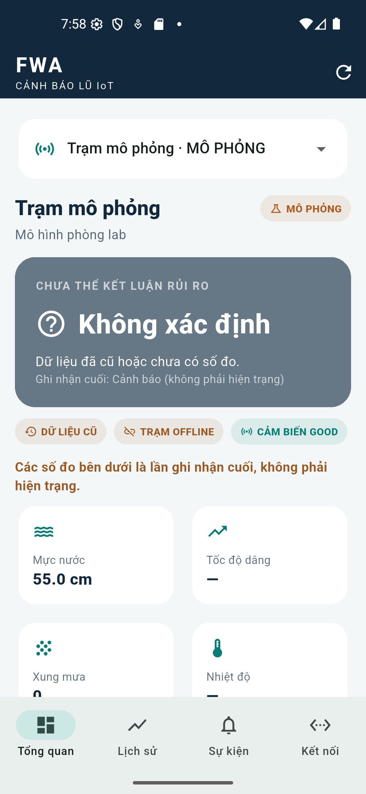
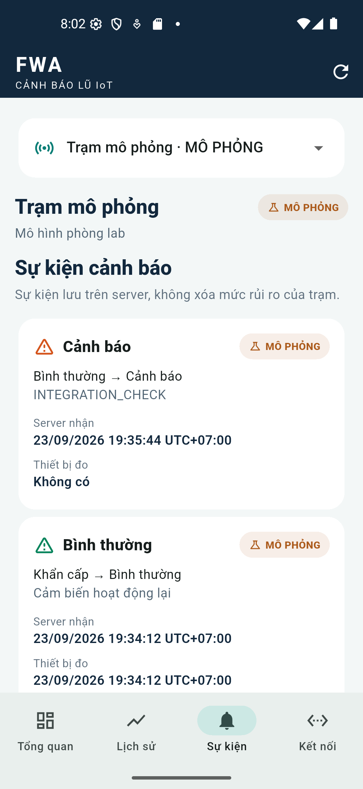
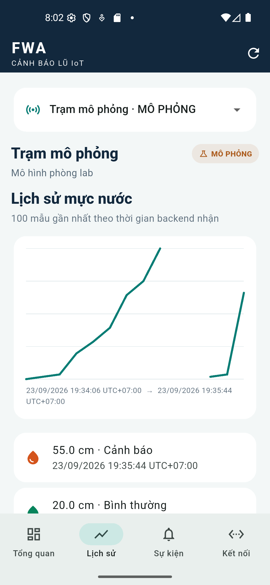

# FWA — Trạm cảnh báo lũ IoT

Repository bàn giao **hai sản phẩm**: (1) hệ thống IoT cảnh báo lũ tại trạm là sản phẩm cốt lõi; (2) ứng dụng Flutter Android để quan sát và demo. ESP32 đo mực nước, tự quyết định cảnh báo và điều khiển đèn/còi. MQTT và backend chỉ chuyển/lưu trạng thái cho điện thoại, không quyết định thay trạm. Dữ liệu từ simulator luôn mang danh tính trạm riêng và được hiển thị là **MÔ PHỎNG**.

## Thành phần

| Thư mục | Vai trò |
|---|---|
| `firmware/` | ESP32, cảm biến A02YYUW, state machine và còi/đèn cục bộ |
| `backend/` | NestJS, MQTT, PostgreSQL, REST và WebSocket |
| `mobile/` | Flutter Android: trạm, số đo, lịch sử và sự kiện |
| `simulator/` | Kịch bản demo lặp lại được |
| `infra/` | Docker Compose, Mosquitto ACL và PostgreSQL |
| `docs/` | Hợp đồng dữ liệu, quyết định và runbook |

Xem [runbook](docs/runbook.md) để khởi động demo. Dự án là prototype phòng lab; ngưỡng trong cấu hình là **DEMO ONLY** và không dùng để đưa ra quyết định an toàn ngoài thực địa.

## Giao diện ứng dụng

Ứng dụng có tab **Bản đồ** cho demo IoT tại ba lưu vực: Thao–Chảy, Hương–Bồ và Vu Gia–Thu Bồn. Mỗi pin và số đo đều là dữ liệu mô phỏng theo cảm biến của project; tọa độ là điểm tham khảo, không xác nhận vị trí cảm biến đã lắp ngoài thực địa. Bản đồ nền OpenStreetMap tải qua mạng khi mở tab, không đóng gói tile vào APK.

Kịch bản nước dâng cập nhật mỗi 2 giây (tương đương 1 phút mô phỏng), tăng 0,5 cm/phút mô phỏng. Các mức demo lấy theo firmware: 30/50/70 cm; cần 3 mẫu liên tiếp để nâng cấp cảnh báo, có hysteresis 5 cm và 4 mẫu để hạ cấp. Mỗi mức chỉ phát thông báo một lần trong một lượt mô phỏng; **đây không phải cảnh báo thực tế**.

Để tạo APK release nhỏ theo kiến trúc thiết bị, chạy trong `mobile/`:

```sh
flutter build apk --release --split-per-abi
```

Điện thoại Android ARM64 dùng `mobile/build/app/outputs/flutter-apk/app-arm64-v8a-release.apk`; máy ARM 32-bit dùng `app-armeabi-v7a-release.apk`.






